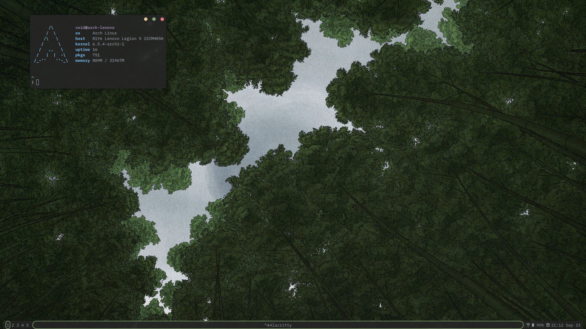
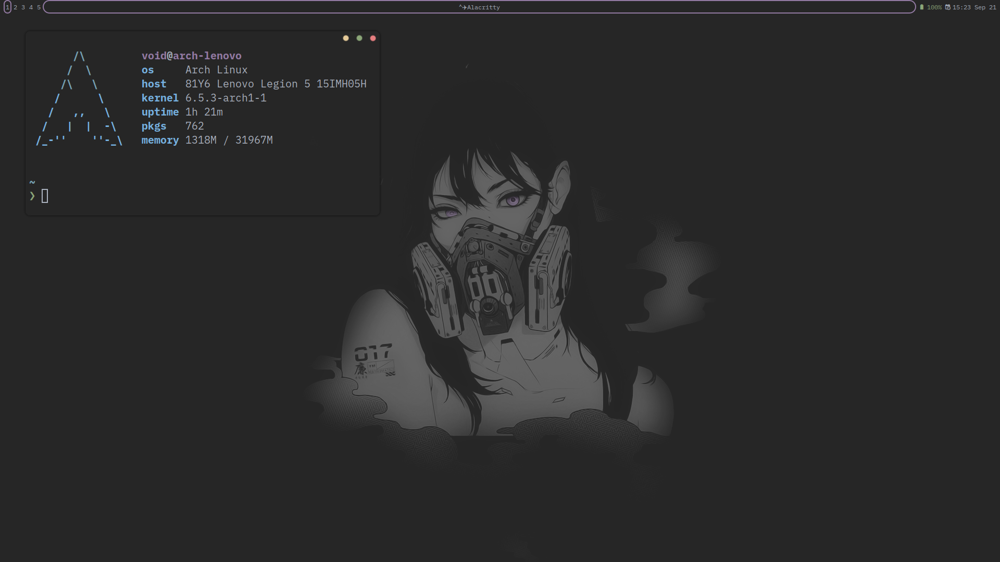

# awesomewm

Dotfiles for the Awesome window manager

## Roadmap

- [X] Improve wibar
- [ ] Make configuration modular

## Customization

Core functionality is configured in `rc.lua`, appearance is defined by a theme.

There are two themes:

- Forest

- Subtle Gray

To create a theme simply copy and rename an existing theme, and modify it as you see fit.

## Screenshots

- Forest

- Subtle Gray

