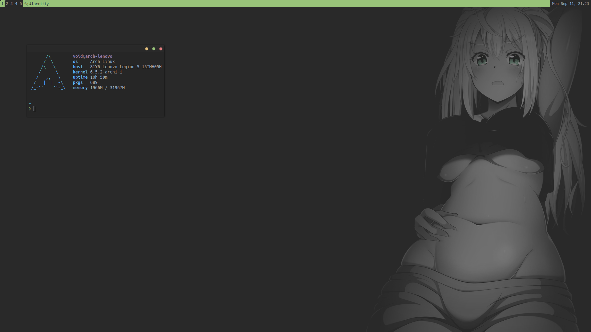
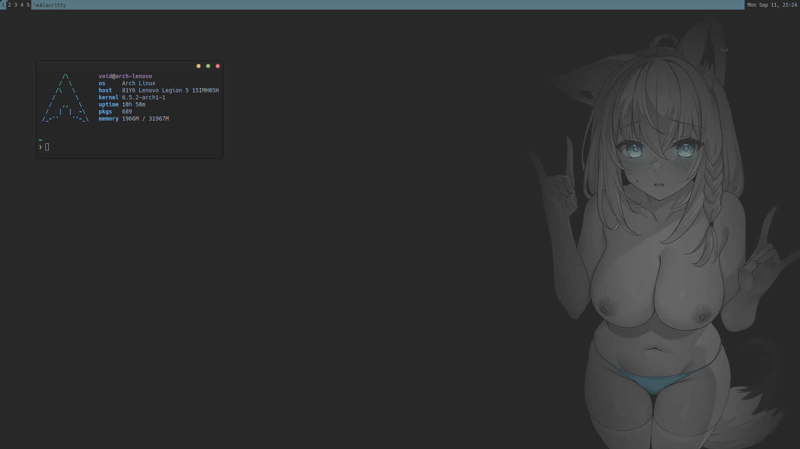

# awesomewm

Dotfiles for the Awesome window manager

## Customization

Core functionality is configured in `rc.lua`, appearance is defined by a theme.

There are three default themes:

- Subtle Gray (safe for work)

- Subtle Green (sketchy)

- Subtle Blue (not safe for work)

To create a theme simply copy and rename an existing theme, and modify it as you see fit.

## Screenshots

- Subtle Gray

- Subtle Green

- Subtle Blue

## To Do

- [ ] Split up config
