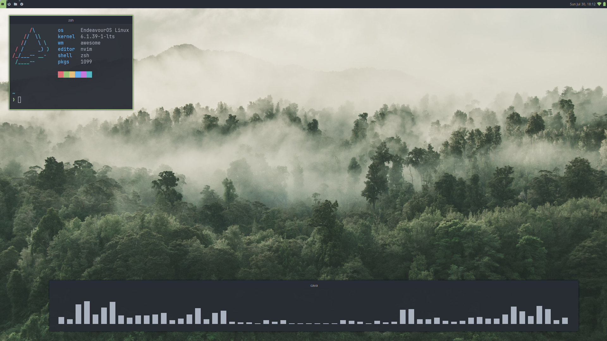

# awesomewm
Dotfiles for the Awesome window manager

## Install

**For Arch users:**

*Core*
```
$ sudo pacman -S awesome
```

*Extra*
```
$ sudo pacman -S wezterm nm-applet ttf-jetbrains-mono-nerd picom neovim acpi
```

## Screenshots


